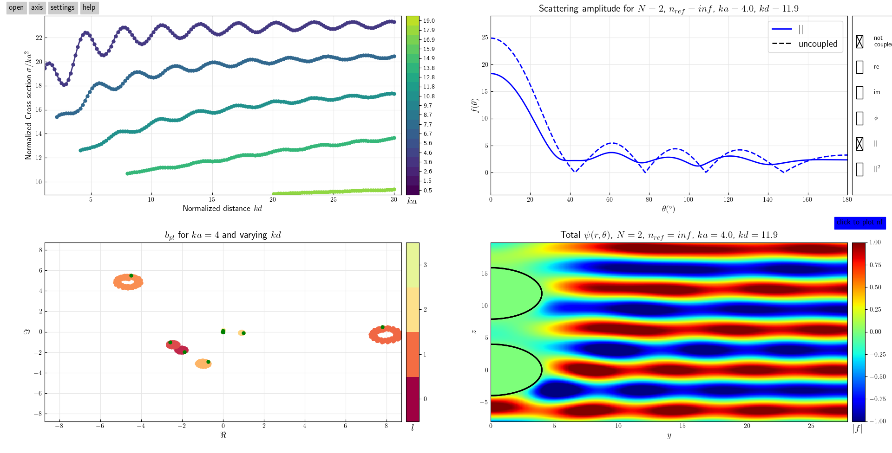

# pyScatSpheres

Package for solving the scalar wave equation  with a linear array of scattering spheres.
Possibility to solve for constant potential well and hard spheres i.e. infinite potential.

## Installation
`pip install pyScatSpheres`

## Using the GUI
A gui is available to interactively display pre calculated solutions.

```python
from pyScatSpheres import gui_base as gui
sa = gui.GUI_handler()
```

[](figures/gui_screenshot.png)

## Using the API
New sets of solution can be calculated and solved to a pickle using the API.

```python
import numpy as np
import pandas as pd
from pyScatSpheres import qdot_sphere_array as qsa
from pyScatSpheres import glob_colors as colors

kas = [0.5,2,5]
kds = [2,5,10]
kps = [1.2]
kas,kps,kds = np.meshgrid(kas,kps,kds)
kas,kps,kds = kas.flatten(),kps.flatten(),kds.flatten()
cols = ['N','ka','kp','kd','nmax','sigma','ap','bp']
df = pd.DataFrame(columns=cols)
for ka,kp,kd in zip(kas,kps,kds):
    nmax = max(int(np.ceil(1.3*ka)),int(ka)+4)
    s = qsa.QdotSphereArray(N=N,ka=ka,kp=kp,kd=kd*ka,nmax=10,solve=1,copt=1)
    sig = s.get_s(npts=1000)
    df=df.append(dict(zip(cols,[s.N,s.ka,s.kp,s.kd,s.nmax,sig,s.ap,s.bp])),ignore_index=True)
df.to_pickle(df_name)
print(colors.green+'DataFrame saved:\n'+ colors.yellow+df_name+colors.black)
```
