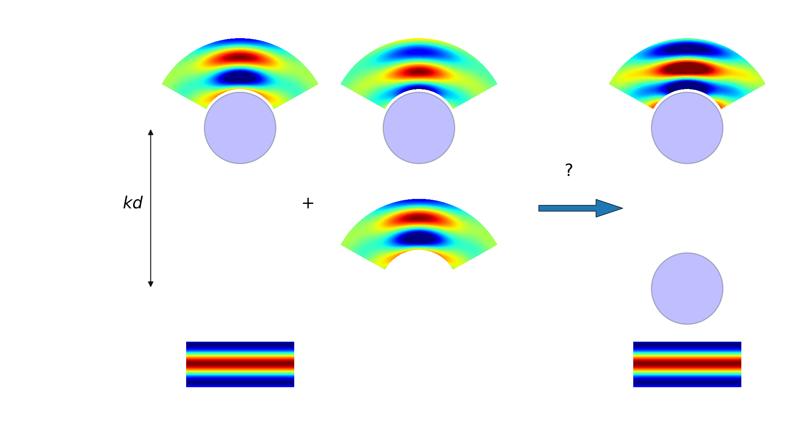

# Linear array N constant potential spheres






## Formulation
A solution of the Schrodinger equation is sought in spherical coordinate systems :
\begin{equation}
  \Big(-\frac{\hbar^2}{2m_e}\grad_{\bb r}^2 - eV(\bb r) \Big) \Psi = E\Psi
\end{equation}

where the potential $V$ is composed of an array of spheres of radius $a_p$ in which the potential is constant $V_p$.

This equation can be written in each domain as :
\begin{eqnarray}
  \grad_{\bb r}^2\Psi  +\frac{2m_eE}{\hbar^2}\Big(1+\frac{eV}{E}\Big)\Psi &=& 0\\
  \grad_{\bb r}^2\Psi  + k_p^2 \Psi &=& 0\\
\end{eqnarray}
where $k_p=k_0\sqrt{1+V_0/E}$ and $k_0^2=2m_eE/\hbar^2$.
This is the Helmholtz equation whose radial solutions in spherical coordinates are the spherical Bessel functions and spherical Hankel functions of the first kind.

The fast electron approximation looks at the solution of this problem in Cartesian coordinates where $\Psi=\Psi(x,y,z)e^{jk_0z}$ and assuming $\dP^2_z\ll 1$ so that :
\begin{eqnarray}
  \grad_{\bb \rho}^2\Psi + \dP^2_z\Psi + 2jk_0\dP_z\Psi - k_0^2\Psi + k_p^2 \Psi &=& 0\\
  2jk_0\dP_z\Psi + \grad_{\bb \rho}^2\Psi + k_0^2\frac{V_0}{E} \Psi &=& 0\\
\end{eqnarray}
which can be solved as :
\begin{eqnarray}
  \dP_z\Psi &=& j/2k_0\grad_{\bb \rho}^2\Psi + jk_0/2\frac{V_0}{E} \Psi \\
  \Psi(z) &=& e^{j\frac{\lambda}{4\pi}\grad_{\bb \rho}^2} e^{jk_0/2\frac{v_z}{E}} \Psi(0) \\
  \Psi(z) &=& e^{j\frac{\lambda}{4\pi}\grad_{\bb \rho}^2} e^{j\sigma v_z} \Psi(0) \\
\end{eqnarray}

where $\sigma=k_0/2E=2\pi m_e\lambda/h^2$.

In multislice, relativistic effects are included by taking the effective mass of the electron $m_e=\gamma m_0$ and the relativistic wavelength $\lambda$ in the expression of $\sigma$.

### Scattered field
The scattered wave function inside and outside of the $p$th sphere, $p=1..N$, is expressed as :
\begin{eqnarray}
  f_p^{(in )}(\bb r_p) &=& \sum_{l=0}^{\infty}a_{pl}j_l(k_pr_p)Y_l^0(\theta_p)\\
  f_p^{(out)}(\bb r_p) &=& \sum_{l=0}^{\infty}b_{pl}\hl(k_0r_p)Y_l^0(\theta_p)\\
  k_p &=& k_0\sqrt{1+\frac{V_p}{E}}\\
  k_0 &=& \sqrt{\frac{2m_eE}{\hbar^2}}\\
\end{eqnarray}

where $E_0$, $k_0$ are the energy and wave number of the incident wave, $k_p$, $V_p$ the wave number and constant potential inside the sphere,
$j_l$ and $\hl$ are the spherical Bessel and Hankel functions of the first kind, $Y_l^0$ are the spherical harmonics with azimuthal order 0.

### Continuity relations

The coefficients $a_{p;l}$, $b_{p;l}$ are found imposing the continuity of the wave function and its gradient at the surface of the $p$th sphere.
Since spherical harmonics are used, the continuity of the derivative of the radial part is sufficient to fulfil this condition :
\begin{eqnarray}
      \Big(\sum_{q=1}^N f_q^{(out)}+f^{(i)}\Big)\big|_{r_p=a_p}
  &=& \Big(f_p^{(in)}\Big)\big|_{r_p=a_p} \\
      \dP_{r_p}\Big(\sum_{q=1}^N f_q^{(out)}+f^{(i)}\Big)\big|_{r_p=a_p}
  &=& \dP_{r_p}\Big(f_p^{(in)}\Big)\big|_{r_p=a_p} \\
\end{eqnarray}

Using the translational additions theorem and the orthogonality of the spherical harmonics $\int_{\Omega} Y_{l}Y_{l'}^{*}d\Omega=\delta_{l,l'}$,
the following linear system yields the unknown coefficients :
\begin{eqnarray}
  a_{pl}j_l(k_pa_p)
    &-& b_{pl}\hl(k_0a_p)\\
    &-& j_l(k_0a_p)\sum_{q\neq p}^{N}\sum_{n=0}^{\infty} a_{n0,l0}(k_0d_{pq},\theta_{pq})b_{qn}
      = e^{jk_0d_p}c_lj_l(k_0a_p) \\
  k_p a_{pl}\dP_{\rho} j_l(k_pa_p)
    &-& k_0 b_{pl}\dP_{\rho}\hl(k_0a_p) \\
    &-& k_0 \dP_{\rho}j_l(k_0a_p)\sum_{q\neq p}^{N} \sum_{n=0}^{\infty} a_{n0,l0}(k_0d_{pq},\theta_{pq})b_{qn}
      = k_0e^{jk_0d_p}c_l\dP_{\rho}j_l(k_0a_p)
\end{eqnarray}

where :
\begin{eqnarray}
  c_l  &=& j^l(2l+1)\sqrt{\frac{4\pi}{2l+1}}\\
  a_{l0;n 0}^{out-in}(kd_{pq},\theta_{pq})
    &=& 4\pi\sum_{q=|l-n|}^{l+n}(-j)^{l-n-q} \hl(kd_{pq})Y_l^0(\theta_{pq})\cc G(l,n,q,0,0,0)
\end{eqnarray}

### Linear system
The linear system can also be written :
\begin{equation}
  \big(\bb P - \bb T \big)\bb A = \bb L
\end{equation}

where $\bb A=(\bb a_{pl}, \bb b_{pl})$ is the unknown vector,
$\bb P$ the matrix of each individual uncoupled sphere :
\begin{equation}
\bb P = \left[
  \begin{array}{ccccccc}
  j_0(k_1a_1)       &\bb 0&  0               &-h_0(k_0a_1)    &\bb 0&  0              \\
                    & ... &                  &                & ... &                 \\
    0               &\bb 0&j_M(k_Na_N)       &  0             &\bb 0&-h_M(k_0a_N)     \\
  n_1j_0^{'}(k_1a_1)&\bb 0&  0               &-h_0^{'}(k_0a_1)&\bb 0& 0               \\
                    & ... &                  &                & ... &                 \\
    0               &\bb 0&n_Nj^{'}_M(k_Na_N)&  0             &\bb 0&-h_M^{'}(k_0a_N) \\
  \end{array}\right]
\end{equation}

, $\bb T$ is the cross-coupling matrix and :
\begin{eqnarray}
\bb T &=& \left[
  \begin{array}{cc}
    \bb 0 & \bb T_p     \\
    \bb 0 & \bb T_p^{'}
  \end{array}\right] \\
\bb T_p     &=& \bb j_l(k_0a_p)     \sum_{q\neq p}^{N}\bb A_{pq}^{(out-in)}\\
\bb T_p^{'} &=& \bb j_l^{'}(k_0a_p) \sum_{q\neq p}^{N}\bb A_{pq}^{(out-in)}
\end{eqnarray}
and :
\begin{equation}
\bb A_{pq}^{(out-in)} = \left[
  \begin{array}{cccc}
  0 & .. & a_{M0;00}^{(out-in)}(k_0d_{pq},\theta_{pq}) \\
  .. & 0 & ..\\
  a_{00;M0}^{(out-in)}(k_0d_{pq},\theta_{pq}) & .. & 0 \\
  \end{array}\right]
\end{equation}

and $\bb L$ the incident wave :
\begin{equation}
\bb L =
  \left[\begin{array}{c}
    c_0e^{jk_0d_1}j_0(k_0a_1)\\...\\c_Me^{jk_0d_N}j_M(k_0a_N)\\c_0e^{jk_0d_1}j_0^{'}(k_0a_1)\\...\\c_Me^{jk_0d_N}j_M^{'}(k_0a_N)
  \end{array}\right]
\end{equation}

<!-- where $j_l^p = j_l(k_pa_p)$, $h_l^p = h_l^{(1)}(k_0a_p)$  -->
where $z_l^{'}=\dP_{\rho}z_l(\rho)$.

### Far field scattering
In the far field,
$\hl(k_0r_p)\approx (-j)^{l+1}\frac{e^{jk_0rp}}{k_0r_p}$, $\theta_p\approx\theta$
$r_p\approx r-d_p\cos\theta$,
\begin{eqnarray}
  r^2 &=& r_p^2 + d_p^2 + 2r_pd_p\cos\left(\theta-\Theta_p\right)\\
      &\approx& r_p^2\big(1+2d_p/r_p\cos\left(\theta-\Theta_p\right)\big)\\
  r   &\approx& r_p + d_p\cos\left(\theta-\Theta_p\right)\\
\end{eqnarray}

so the scattering amplitude from the $pth$ sphere $f_p(\theta)$ can be written :  
<!-- $\frac{e^{jkr}}{kr} f_p(\theta)$ where : -->

\begin{equation}
  f_p(\theta) = \sum_{l=0}^{\infty} (-j)^{l+1}b_{pl}Y_l^0(\theta)
\end{equation}
where we have used the notation $f_p(r_p,\theta)=\frac{e^{jk_0r_p}}{k_0r_p}f_p(\theta)$.

The total scattering amplitude is the sum of the contribution from all individual spheres.
\begin{eqnarray}
  f(\theta) &=& \sum_{p=1}^{N} f_p(\theta)e^{-jk_0d_p\cos\theta} \\
            &=& \sum_{l=1}^{\infty}(-j)^{l+1}Y_l^0(\theta)
              \sum_{p=1}^{N} b_{pl}e^{-jk_0d_p\cos\theta} \\
\end{eqnarray}
where we have used the notation $f(r,\theta) = \frac{e^{jk_0r}}{k_0r}f(\theta)$.

The normalized differential scattering cross section is therefore :
\begin{equation}
  \frac{\sigma(\theta)}{\pi a_p^2} = \frac{4|f(\theta)|^2}{\left(k_0a_p\right)^2}
\end{equation}

where we have used the definition $\sigma=4\pi r^2 \Bigg |\frac{f(r,\theta)|}{f^{(i)}(r,\theta)}\Bigg|^2$.

## Approximate solutions
### Forward Scattering Approximation

Since back scattering is small, the scattering from the sphere located after the first sphere can be sought with an approximate solution using the analytical response to a spherical Hankel function $\Psi_{\nu0}^{(out)}$ located in $-kd$.

Using the translation theorem for this input function this gives :

\begin{eqnarray}
  a_{pl} &=& c_{l}\frac{-h_0^{'}j_0 + h_0j_0^{'}}{n_pj_1^{'}h_0 - j_1h_0^{'}} \\
  b_{pl} &=& c_{l}\frac{-n_pj_1^{'}j_0 + j_1j_0^{'}}{n_pj_1^{'}h_0 - j_1h_0^{'}} \\
  c_l &=& a_{\nu,0;l,0}^{(out-in)}(kd_p,0,0)
\end{eqnarray}

Therefore the response to $\sum_{\nu} b_{p,\nu}\Psi_{\nu0}^{(out)}$ is :
\begin{equation}
  c_l^{(s)} = u_l\sum_{\nu} b_{p,\nu}a_{\nu,0;l,0}^{(out-in)}(kd_p,0,0)
\end{equation}

Note that this is the same as solving the coupled system but setting the sums
over $\sum_{q<p}$ which is a triangular by block system whose inversion is trivial.

### Secondary Scattering approximation

A less conservative approximation which only requires matrix multiplication and therefore afford full parallelization is the Forward Secondary Scattering approximation. It simply consists in computing :
\begin{eqnarray}
  \bb b_p &=& \bb P_b^{-1}\big(\bb L_b + \bb T_b\bb b_p^{(0)} \big)\\
          &=& \big(\bb I + \bb P_b^{-1}\bb T_b \big)\bb P_b^{-1}\bb L_b\\
\end{eqnarray}

where $\bb b_p^{(0)}$ is the response of the spheres to incident wave and $\square_b$ means the part related to $b_p$.

### Far field error estimate
A figure of merit can be defined as the error in the far field diffraction pattern :

\begin{equation}
  \epsilon_{ff} = \int_{\Omega}\Big|
      f^{(approx)}(\theta)-f^{(exact)}(\theta)\Big|^2d\Omega
\end{equation}

Otherwise, in the interest of diffraction physics, we can also look at the relative error of peaks intensities :

\begin{equation}
  err(ff) = \sum_{i}
    \frac{\Bigg|\big|f_i^{(approx)}\big|^2-\big|f_i^{(exact)}\big|^2\Bigg|}{\big|f_i^{(exact)}\big|^2}
\end{equation}
where $f_i=f(\theta_i)$ and $\theta_i$ are the peak locations.

<!--
#######################################################################
#######################################################################
#######################################################################
                  Single sphere
#######################################################################
#######################################################################
#######################################################################
 -->
## Single qdot sphere scattering

### Analytical solution

Using the orthogonality of the spherical harmonics the unknown coefficients are :

\begin{eqnarray}
  j_l(k_pa_p) a_{pl} - \hl(k_0 a_p) b_{pl}
    &=& j_l(k_0a_p) c_{l}e^{jkd_p} \\
  n_p\dP_{\rho} j_l(k_pa_p) a_{pl} - \dP_{\rho} \hl(k_0 a_p) b_{pl}
    &=& \dP_{\rho} j_l(k_0a_p) c_{l}e^{jkd_p} \\
\end{eqnarray}

\begin{eqnarray}
  a_{pl} &=& c_{l}\frac{-h_0^{'}j_0 + h_0j_0^{'}}{n_pj_1^{'}h_0 - j_1h_0^{'}} \\
  b_{pl} &=& c_{l}\frac{-n_pj_1^{'}j_0 + j_1j_0^{'}}{n_pj_1^{'}h_0 - j_1h_0^{'}} \\
  c_l &=& j^l(2l+1)\sqrt{\frac{4\pi}{2l+1}}\\
\end{eqnarray}

where :
$j_1=j_l(k_pa_p)$, $j_0=j_l(k_0a_p)$, $h_0=\hl(k_0a_p)$ and
$j_1^{'}=\dP_{k_pr}j_l(k_pa_p)$, $j_0^{'}=\dP_{k_0r}j_l(k_0a_p)$, $h_0^{'}=\dP_{k_0r}\hl(k_0a_p)$.

 . | a) $i$ | b) $s$ | c) $t$  
-- | ------ | ------ | ------
$\psi(\bb r)$  |  |  | 

 . | d) $i$ | e) $s$ | f) $t$
 -- | ------ | ------ | ------
$\dP_r\psi$  |  |  | 

a,d) Incident, b,e) scattered and c,f) total wave function $\psi(\bb r)$ and radial derivative $\dP_r\psi(\bb r)$ for a single sphere with $ka=3$, $n_{ref}=1.5$.

### Scattering amplitude and cross section
a  | b  | c  
-- | -- | --
 |  | 

Scattering amplitude for a few normalized radius $ka$ and potential strength
a) $k_p=1.1$ b) $k_p=1.001$ c) $k_p=1.0001$.

a  | b
-- | --
 | 

Normalized scattering cross section in $\sigma$ in a) $\log$ and b) linear scales for a few values of $k_p$ over a range of normalized radius $ka$.

It is noted that in the weak scattering regime $kp-1\ll 1$ and not too large spheres $ka$, the shape of the diffraction pattern is identical to the Born approximation. Only the amplitude of the scattering cross section increases with radius. In this regime the spheres  

### Small potential limit : Born approximation

If the potential is small $\epsilon=V_0/E\ll 1$, the first Born approximation is valid so that the scattering amplitude (expressed in $A$) are found from the Fourier transform of the potential :
\begin{eqnarray}
  f(\bb q) &=& \frac{2m_e}{4\pi\hbar^2}
    \int V(\bb r)e^{-j\bb q\cdot\bb r}d\bb r \\
           &=& \frac{k_0^2}{2}\epsilon\int_0^{a}
    \int_0^\pi e^{-jqr\cos\theta}r^2dr\sin\theta d\theta\\
  f(q)  &=& k_0^2\frac{\epsilon}{q}\int_0^{a}\sin(qr)rdr\\
        &=& \epsilon \frac{a^3k_0^2}{q^2a^2}
    \Big(-\cos qa + \frac{\sin qa}{qa}\Big)\\
\end{eqnarray}
where the $q=2k_0\sin\frac{\theta}{2}$ is the momentum transfer wave vector and $\theta$ the scattering angle.

<!-- \begin{equation}
f(q) = \frac{V_0}{E} \frac{a^3k_0^2}{q^2a^2}\Big(-\cos qa + \frac{\sin qa}{qa}\Big)
\end{equation} -->

a) $abs(f(\bb qa))$ | b) $f(\theta),\epsilon\ll 1$ | c) $f(\theta),\epsilon\approx 1$
------------- | --------------- | --------------
 |  | 

a) Fourier transform of the potential in normalized qa momentum space. The circles show the transfer momentum vector for different values of the normalized radius $ka$. b,c) Scattering amplitudes for different values of $ka$ for b) negligible potential $\epsilon=V_0/E\ll 1$,  c) moderate potential $\epsilon\approx 1$. The dots are exact calculation and dashed lines use the Born approximation.

### Multislice approach : weak phase approximation

Using multislice in the weak phase approximation, the wave function in the far field $\psi(\bb q)$ is the Fourier transform of the transmission function $T$ :
\begin{eqnarray}
  \psi_{ms}(\bb q) &=& \hat T(q_x,q_y) =
    \cc F_{2D}\Big[e^{j\sigma V_z(x,y)} \Big] \\
  V_z(x,y) &=& \int_{\cc B} V(x,y,z) dz  =
    \cc F^{-1}\big[\hat V(q_x,q_y,0)\big]\\
  V_z(\rho,\phi)&=& 2V_0\sqrt{a^2-\rho^2} ~\mbox{,}~~ \rho\le a
\end{eqnarray}

where $2\sigma V_0=k_0\epsilon$, $\hat T(q_x,q_y,0)$ is the 2D Fourier transform of the transmission function and $V_z$ the projected potential.

The scattering amplitude can be calculated by removing the forward propagation and using the Fourier transform in polar coordinates, the trans
\begin{eqnarray}
  f(\bb q) &=& \cc F_{2D} \Big[1-e^{j\sigma V_z(x,y)}\Big]\\
           &=& 2\pi \int_0^a \Big(1-e^{j\sigma V_z(\rho)}\Big) J_0(q\rho)\rho d\rho
\end{eqnarray}

 where $J_0$ is the zeroth order Bessel function.

 $ka=10$ | $ka=30$ | $ka=60$
 --------| ------- | --------
  |  | 

### Multi-shell single sphere scattering
For a multi-shell sphere with constant potential, the radial Fourier transform of the potential can be computed thanks to the linearity of the FT using the expression of the single shell sphere.

For a $N$-shell with radius $r_i$, potential strength $\epsilon_i$:
\begin{eqnarray}
  f(q) &=& \frac{k_0^2}{q}\sum_{i=1}^{N}
    \epsilon_i\int_{r_{i-1}}^{r_i} \sin(qr)rdr\\
       &=& \frac{k_0^2}{q}\sum_{i=1}^{N}\epsilon_i
    \int_{0}^{r_i} \sin(qr)rdr - \epsilon_i\int_{0}^{r_{i-1}} \sin(qr)rdr\\
       &=& \sum_{i=1}^{N}
    \Big(f_i(q)-\frac{\epsilon_{i}}{\epsilon_{i-1}}f_{i-1}(q)\Big)\\
       &=& f_N + \sum_{i=1}^{N}
    \frac{\epsilon_i-\epsilon_{i+1}}{\epsilon_i}f_{i}(q)
\end{eqnarray}

a  | b  | c
-- | -- | --
 |  |   

a) Multi-shell description of the potential
b) Scattering amplitude increasing largest shell up to $ka=500$
c) Scattering increasing number of shells up to $N=40$ using $ka_{max}=500$

It is important to take the very low index high range spheres to account for the
proper low angle representation of the scattering amplitude. It is also important to sample sufficiently to prevent appreciable ripples at large angles.
The combination $ka_{max}=400$, $N=15$ would an acceptable set of parameters.

<!--
#######################################################################
                  Two sphere
#######################################################################
-->

## 2 qdot spheres scattering

$ka=1.00$ | $ka=5.00$ | $ka=15.0$
--------- | --------- | --------
 |  | 
 |  | 

### Validity range for the forward scattering approximation

We can test the validity of the approximation for a 2 sphere scattering
system.

a  | b  | c  
-- | -- | --
 |  | 
| | 

$(ka,kd/ka)$ map with color axis as the $\log_{10}(\cc L_2)$ error of the
$\cc L_2$ norm of the scattering amplitudes with the
up) forward scattering approximation
down) uncoupled (kinematic) approximation
for a) $k_p=1.1$, b) $k_p=1.01$, c) $k_p=1.001$.

a  | b  
-- | --
 | 

$(ka,k_p)$ map with color axis as the $\log_{10}(\cc L_2)$ error of the
$\cc L_2$ norm of the scattering amplitudes with
a) the forward scattering approximation
b) the uncoupled (kinematic) approximation.
The blue dot correspond to the location of the [spherical shells](#multi-shell-single-sphere-scattering) of Carbone atom
at $E=200keV$.

Both the uncoupled and forward scattering approximation work better with increasing distances $kd$ since scattering from the spheres reduces with distance. It is therefore less likely to affect scattering from the other spheres.
The low values of $k_p$ result in overall good approximation of both the uncoupled and forward scattering approximation. This is an anticipated result since for weak potentials, the kinematic approximation is more valid.
The uncoupled approximation improves with small radii since Small $ka$ result in small scattering cross section,
On the other hand the forward scattering approximation improves with larger values of $ka$ since backward scattering is less likely for large $ka$.

## N spheres

### Validity of the approximations

a  | b  | c  
-- | -- | --
 |  | 
| | 

up) $\log_{10}(\cc L_2)$ error of the $\cc L_2$ norm of the scattering amplitudes with increasing number of spheres for a few radii for
a) $k_p=1.01$  b) $k_p=1.001$ and  b) $k_p=1.0001$.
down) examples of scattering amplitude profiles.

### Selected far field scattering amplitudes

a  | b  | c
-- | -- | --
 |  |  

Far field scattering amplitudes for $N=5$, $ka=2$, $n_{ref}=1.2$ for
distance a) $kd=2.50ka$, b) $kd=5.00ka$ and c) $kd=10.0ka$.

a  | b  | c
-- | -- | --
 |  |  

Far field scattering amplitudes for $ka=2$,$kd=4ka$,$n_{ref}=1.01$
for a) $N=2$, b) $N=5$ and c) $N=10$.
